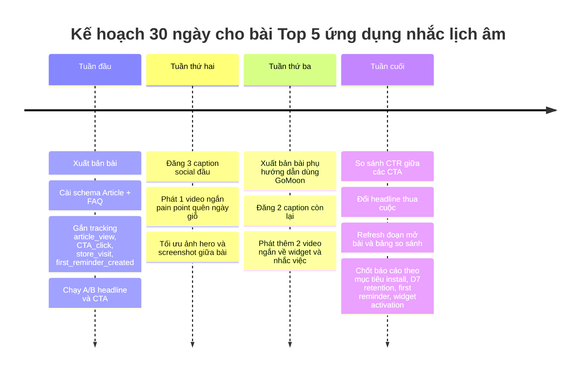

# Top 5 ứng dụng nhắc lịch âm tốt nhất hiện nay

## Tóm tắt điều hành

Nếu nhu cầu chính của người đọc là **không quên ngày giỗ, ngày lễ âm lịch và các việc cá nhân lặp theo lịch âm hoặc dương**, thì thị trường thực tế không nhiều app làm gọn và đúng bài; phần lớn app phổ biến hiện nay nghiêng về “siêu ứng dụng” lịch vạn niên, tử vi và phong thủy. Dựa trên trang giới thiệu GoMoon, listing chính thức trên App Store/Google Play, cùng dữ liệu từ các app đối thủ và bài tổng hợp của Thế Giới Di Động, Hoàng Hà Mobile, **GoMoon có lợi thế rõ nhất ở hướng nhắc lịch âm tối giản, widget ngoài màn hình và riêng tư**, còn các app lớn thắng ở độ phủ, số đánh giá và lượng tính năng mở rộng. citeturn2view0turn13view0turn1view0turn19view0turn19view1turn21view2turn12view1

## Cách xếp hạng

Bài này xếp hạng theo **đúng use case “nhắc lịch âm”** chứ không xếp đơn thuần theo lượt tải. Trọng số lớn nhất được đặt vào: khả năng nhắc theo âm/dương, widget ngoài màn hình, mức độ rõ ràng của thông tin ngày tốt/giờ tốt, độ đơn giản khi dùng hằng ngày, và tín hiệu tin cậy từ listing chính thức cùng phản hồi người dùng. Cách chọn này bám sát đúng những tiện ích mà các bài tổng hợp từ Thế Giới Di Động và Hoàng Hà Mobile cũng coi là quan trọng khi chọn app lịch âm: widget, nhắc sự kiện, đồng bộ và khả năng hỗ trợ lên kế hoạch cho các ngày lễ, giỗ chạp, việc lớn. citeturn19view0turn19view1turn19view2

Với các mục như **cloud sync**, **chia sẻ**, hoặc **độ chính xác âm-dương**, tôi chỉ ghi “có”, “không”, hoặc “không rõ” khi có căn cứ từ mô tả chính thức hoặc nguồn uy tín. Khi không có benchmark độc lập công khai, phần “độ chính xác” được diễn giải theo **tuyên bố của nhà phát triển và lịch sử cập nhật** chứ không xem là kiểm định tuyệt đối. citeturn13view1turn21view2turn22view0turn16view1

## Top ứng dụng nhắc lịch âm nên thử

**GoMoon** đứng đầu nếu mục tiêu của bài là phục vụ đúng nhu cầu “nhắc lịch âm mà không bị rối”. GoMoon hiện có mặt trên **Google Play** và **App Store**; Google Play đang hiển thị **10+ lượt tải**, còn App Store Việt Nam hiển thị **5,0/5 từ 9 đánh giá**. Điểm mạnh nhất của app không phải ở độ phủ, mà ở việc mô tả và trải nghiệm đều tập trung vào một việc rất rõ: nhập sự kiện một lần, nhắc theo lịch âm hoặc dương, xem việc sắp tới ngay trên **widget màn hình chính** và **widget màn hình khóa**, đồng thời lưu dữ liệu ngay trên thiết bị, không thu thập dữ liệu và không quảng cáo. Trên App Store, review hiện có cũng khá đồng nhất ở các ý như app gọn, mượt, dễ dùng và phản hồi của nhà phát triển cho thấy tốc độ cập nhật nhanh, ví dụ dark mode đã được bổ sung sau góp ý, rồi sau đó thêm lock-screen widget và thông tin ngày tốt/giờ tốt trong các bản cập nhật gần đây. Về mặt biên tập, đây là lý do GoMoon xứng đáng xếp số một trong một bài viết nhắm vào từ khóa “nhắc lịch âm”, dù app vẫn còn rất mới về mặt traction. citeturn13view0turn13view1turn12view4turn2view0

Ưu điểm của GoMoon là định vị dễ hiểu, không ôm quá nhiều tử vi/phong thủy, có widget ngoài màn hình và thông điệp “một lần nhập, nhắc mãi” rất hợp pain point quên ngày giỗ. Điểm trừ là social proof còn mỏng, chưa thấy nêu rõ sao lưu đám mây hoặc chia sẻ gia đình trên listing hiện hành. App này hợp nhất với người dùng muốn một **app nhắc ngày giỗ, lễ âm và việc cá nhân** gọn nhẹ hơn là một “bách khoa phong thủy”. citeturn2view0turn13view0turn13view1

**Lich Van Nien - Lịch VN 2026** là đối thủ đại chúng mạnh nhất trong danh sách nếu nhìn theo độ phủ trên Android. Google Play hiển thị app này ở mức **5 Tr+ lượt tải**, **4,7 sao** và khoảng **155 nghìn đánh giá**. Mô tả chính thức nêu các tính năng rất rộng: xem lịch ngày/tháng, đổi âm-dương nhanh và chính xác, thời tiết, nhịp sinh học, văn khấn, hướng và ngày giờ xuất hành, **widget giờ-ngày-tháng**, **ghi chú theo lịch âm hoặc dương**, và **nhắc lịch theo sự kiện**. Ghi chú trong phần cập nhật còn cho thấy app từng thêm nhắc sự kiện trước **3, 7, 10, 15 ngày** và sửa lỗi đồng bộ dữ liệu, nên về mặt reminder engine nó mạnh hơn nhiều app lịch âm chỉ dừng ở tra cứu. Tuy nhiên, app có quảng cáo và các review gần đây trên Google Play có phàn nàn về mật độ quảng cáo dày. citeturn21view2turn21view3turn21view4turn15view3turn21view0

Ưu điểm của app này là độ phủ lớn, nhiều tính năng, có reminder và widget thật sự dùng được. Điểm trừ là khá nặng tính “all-in-one”, dễ loãng với người chỉ muốn nhắc lịch âm, và quảng cáo có thể làm giảm trải nghiệm. Phù hợp nhất với người dùng Android muốn một app lịch âm rất nhiều tính năng và chấp nhận đánh đổi bằng quảng cáo. citeturn21view2turn21view0

**Lịch Như Ý - Vạn Niên 2026** đứng cao nhờ độ nhận diện thương hiệu mạnh hơn GoMoon nhưng vẫn có lớp tính năng nhắc việc tương đối rõ. Google Play hiển thị **100 N+ lượt tải** và khoảng **3,7 sao**; App Store Việt Nam hiển thị **4,5/5 từ 2,3k đánh giá**. Mô tả chính thức trên Google Play tập trung vào lịch âm dương chính xác, xem ngày tốt, tử vi, phong thủy, numerology và có cả **nhắc nhở sự kiện, sinh nhật, kỷ niệm**. Hoàng Hà Mobile cũng mô tả Lịch Như Ý là app có nhắc nhở sự kiện và đồng bộ lịch với tài khoản Google. Mặt trái là sản phẩm này càng ngày càng nghiêng sang phong thủy và các nội dung mở rộng; hơn nữa trên App Store từng có review phản ánh tình trạng widget không hiện và mất ghi nhớ sự kiện âm lịch sau cập nhật ở một số phiên bản trước. citeturn9view0turn12view1turn14view0turn19view1

Ưu điểm của Lịch Như Ý là lượng người dùng iOS tương đối lớn, reminder có mặt trong mô tả chính thức, và hệ sinh thái nội dung phong thủy rất sâu. Điểm trừ là trải nghiệm “nhắc lịch âm” không còn là trung tâm tuyệt đối; người dùng chỉ muốn một app gọn có thể thấy hơi nhiều tính năng. App này hợp với người thích vừa xem lịch, vừa xem ngày tốt, vừa tham khảo phong thủy trong cùng một nơi. citeturn9view0turn12view1

**Lịch Việt 2026 - Lịch Âm Dương** là lựa chọn khá cân bằng nếu người đọc thích giao diện hiện đại, widget đẹp và các ngày lễ được đếm ngược rõ ràng. Google Play hiện hiển thị **50 N+ lượt tải**, còn App Store Việt Nam cho thấy **5,0/5 từ 4 đánh giá**. Trên Google Play, mô tả nêu app có **widget**, xem ngày tốt xấu, giờ tốt, văn khấn và tuyên bố dữ liệu được tính theo **quy chuẩn lịch pháp quốc gia**. Ở App Store, listing còn nói rõ hơn về **widget tùy biến sâu**, **bộ đếm ngày lễ thông minh** và **thông báo nhắc nhở** để không bỏ lỡ các dịp đặc biệt. Đây là kiểu app khá hợp với người thích theo dõi mùa lễ, Tết, lịch tháng và ngày tốt ngay trên màn hình chính, nhưng bằng chứng công khai về độ phủ và lượng review hiện tại chưa mạnh bằng các tên tuổi lớn hơn. citeturn22view0turn12view3

Ưu điểm của app này là có bộ tính năng tương đối hợp với hành vi xem lịch mỗi ngày, cộng thêm countdown cho ngày lễ và widget cá nhân hóa. Điểm trừ là proof công khai còn mỏng, nhất là ở iOS. Phù hợp với người thích lịch có tính trình bày đẹp, vừa xem lịch vừa theo dõi các mốc lễ trong năm. citeturn22view0turn12view3

**Nhắc Ngày Giỗ** là app niche nhất nhưng lại rất sát với pain point cốt lõi của người dùng gia đình Việt. Google Play hiển thị **1 N+ lượt tải**. Mô tả chính thức nói rõ app dùng để nhắc **ngày giỗ** và **sinh nhật theo lịch âm Việt Nam hoặc lịch dương**, “**một lần nhắc cho cả 100 năm**”, có thể **đồng bộ vào lịch điện thoại/lịch online**, đồng thời hỗ trợ quản lý sự kiện, khách mời, tạo thiệp và mời thiệp online. Điều này khiến app trở thành một lựa chọn đáng lưu ý với hộ gia đình thường xuyên tổ chức giỗ và mời người thân. Tuy vậy, listing hiện không làm rõ widget, lần cập nhật gần nhất thể hiện trên Google Play là **tháng 11/2023**, và điểm đánh giá công khai không hiện rõ trong bản truy cập hiện tại. citeturn7view0turn18view0turn18view1turn18view3

Ưu điểm của app này là đi rất thẳng vào use case “giỗ”, có thêm lớp chia sẻ qua thiệp mời và đồng bộ lịch. Điểm trừ là dấu hiệu bảo trì sản phẩm không mới bằng các app còn cập nhật dày. Phù hợp nhất với gia đình cần một công cụ xoay quanh ngày giỗ nhiều hơn là một lịch âm đa chức năng. citeturn18view0turn7view0

Nhìn tổng thể, **đừng cố viết bài theo hướng “GoMoon lớn hơn đối thủ”** vì dữ liệu công khai không ủng hộ điều đó. Cách thuyết phục hơn là: app lớn thắng ở độ phủ và bề dày tính năng, còn **GoMoon thắng ở chỗ không rối, đi thẳng vào nhắc lịch âm-dương cá nhân, có widget ngoài màn hình và nhấn mạnh riêng tư/no ads**. Với người dùng đang gõ các truy vấn như “nhắc ngày giỗ”, “widget lịch âm”, “app nhắc lịch âm gọn nhẹ”, đó là định vị có cơ hội chuyển đổi tốt hơn nhiều so với cố cạnh tranh bằng tử vi hoặc phong thủy. citeturn13view0turn13view1turn2view0turn21view2turn21view0turn12view1

**CTA biên tập nên chèn ngay sau đoạn này trong bài đăng:** *Tải GoMoon để nhắc ngày giỗ, ngày lễ âm lịch và việc cá nhân ngay trên màn hình điện thoại.*

## Bảng so sánh nhanh

| Ứng dụng | Nền tảng | Số liệu công khai | Kiểu nhắc nhở | Widget | Âm-dương và ngày tốt | Cloud sync hoặc chia sẻ | Từ khóa ASO nên bám | Nguồn |
|---|---|---|---|---|---|---|---|---|
| **GoMoon** | iOS, Android | Play **10+**; App Store VN **5,0/5 – 9 đánh giá** | Giỗ, lễ âm lịch lớn, sự kiện cá nhân theo âm hoặc dương | **Có**, Home Screen và Lock Screen | Có chuyển âm-dương, xem ngày tốt/xấu và giờ tốt; mô tả nêu thuật toán thiên văn chính xác | **Không**, dữ liệu lưu trên máy; chia sẻ **không rõ** | nhắc lịch âm, nhắc ngày giỗ, widget lịch âm, lịch âm dương, ngày tốt giờ tốt | citeturn13view0turn1view0turn13view1turn2view0 |
| **Lich Van Nien - Lịch VN 2026** | Android | Play **5 Tr+**, **4,7 sao**, **155 N** đánh giá | Nhắc lịch sự kiện, ghi chú âm/dương, nhắc trước 3/7/10/15 ngày | **Có** | Đổi âm-dương nhanh và chính xác; có hướng/ngày giờ xuất hành | Có dấu hiệu **đồng bộ dữ liệu**, cơ chế không rõ; chia sẻ **không rõ** | lịch vạn niên, lịch việt, nhắc sự kiện, widget lịch, đổi lịch âm dương | citeturn21view2turn21view3turn21view4turn15view3 |
| **Lịch Như Ý - Vạn Niên 2026** | iOS, Android | Play **100 N+**, ~**3,7 sao**; App Store VN **4,5/5 – 2,3k đánh giá** | Nhắc sự kiện, sinh nhật, kỷ niệm | **Có dấu hiệu có**, nhưng từng có phản ánh lỗi widget ở iOS | Có lịch âm dương, ngày tốt, phong thủy, tử vi | Đồng bộ Google được Hoàng Hà Mobile nhắc tới; listing hiện tại mô tả chi tiết **không rõ** | lịch như ý, lịch vạn niên, xem ngày tốt, nhắc sự kiện, phong thủy | citeturn9view0turn12view1turn19view1 |
| **Lịch Việt 2026 - Lịch Âm Dương** | iOS, Android | Play **50 N+**; App Store VN **5,0/5 – 4 đánh giá** | Countdown ngày lễ, thông báo nhắc dịp đặc biệt | **Có** | Mô tả nêu tính theo quy chuẩn lịch pháp quốc gia; có ngày tốt, giờ tốt | Cloud sync và chia sẻ **không rõ** | lịch việt 2026, lịch âm dương, widget lịch, đếm ngày lễ, ngày tốt xấu | citeturn22view0turn12view3 |
| **Nhắc Ngày Giỗ** | Android | Play **1 N+**; điểm đánh giá **không rõ** | Ngày giỗ, sinh nhật âm và dương; một lần nhắc nhiều năm | **Không rõ** | Có đổi âm-dương và lớp lịch vạn niên cơ bản; nguồn tính chính xác không nêu sâu | **Có** đồng bộ lịch điện thoại/lịch online; **có** tạo thiệp, mời thiệp online | nhắc ngày giỗ, lịch giỗ, sinh nhật âm lịch, đồng bộ lịch, thiệp mời online | citeturn7view0turn18view0turn18view1 |

## Gói SEO và CTA để bài viết kéo cài đặt về GoMoon

Vì GoMoon hiện nổi bật ở **nhắc sự kiện âm/dương**, **widget ngoài màn hình**, **lưu cục bộ**, **không quảng cáo** và **không thu thập dữ liệu**, bài viết nên đi thẳng vào pain point “không quên ngày giỗ/ngày lễ” thay vì mở đầu bằng giao diện hay glassmorphism. Đây là điểm khác biệt dễ hiểu nhất so với các app đại chúng đang ôm rất nhiều lớp nội dung như tử vi, phong thủy, nhịp sinh học, AI hoặc quảng cáo. citeturn2view0turn13view1turn13view0turn16view1turn21view2turn21view0

**Tiêu đề SEO đề xuất**

*Top 5 ứng dụng nhắc lịch âm tốt nhất cho iPhone và Android*

**Meta description đề xuất**

*So sánh 5 app nhắc lịch âm đáng dùng nhất hiện nay: nhắc ngày giỗ, lịch lễ âm, widget ngoài màn hình, ngày tốt giờ tốt. Nếu thích app gọn và riêng tư, hãy thử GoMoon.*

**Các CTA nội bộ và anchor text nên cài trong bài**

| Vị trí | Anchor text đề xuất | Đích nên trỏ |
|---|---|---|
| Hero đầu bài | **Tải GoMoon để nhắc ngày giỗ theo lịch âm** | Phần **Tải miễn phí** trên site GoMoon |
| Sau executive summary | **Xem widget lịch âm và việc sắp tới của GoMoon** | Phần **Giao diện** hoặc **Tính năng** |
| Ngay sau mục xếp hạng GoMoon | **Cài GoMoon trên iPhone** | Trang **App Store** của GoMoon |
| Ngay dưới bảng so sánh | **Chọn GoMoon nếu bạn muốn app lịch âm gọn nhẹ, ít rối** | Phần **Tải miễn phí** |
| Trước đoạn kết luận | **Xem cách GoMoon lưu dữ liệu ngay trên máy** | Phần **Quyền riêng tư** |
| Sticky CTA trên mobile | **Tải GoMoon ngay** | Nút tải store tương ứng thiết bị |
| Cuối bài | **Không còn quên ngày giỗ nữa với GoMoon** | Phần **Tải miễn phí** hoặc bài hướng dẫn cài reminder |

**Năm caption ngắn cho TikTok hoặc Facebook**

- *Quên ngày giỗ một lần là áy náy rất lâu. Đây là 5 app nhắc lịch âm đáng thử nhất hiện nay — và app mình thích nhất lại là app gọn nhất.*
- *Bạn đang dùng app lịch âm để xem ngày tốt, hay để không quên việc quan trọng? Mình vừa tổng hợp xong 5 app đáng cài nhất.*
- *Nếu bạn chỉ cần nhắc ngày giỗ, lễ âm, sinh nhật âm lịch và widget ngoài màn hình, không cần app quá rối — bài này dành cho bạn.*
- *Top 5 app nhắc lịch âm: có app siêu nhiều tính năng, có app cực gọn. Mình nghiêng về kiểu đơn giản như GoMoon hơn.*
- *Từ “lịch âm” đến “nhắc ngày giỗ”: mình đã lọc ra 5 ứng dụng đáng dùng nhất để bạn khỏi mất thời gian tải thử từng app.*

**Ba ý tưởng video ngắn để kéo traffic vào bài**

- **Video ý tưởng “Quên ngày giỗ”**: mở bằng câu “Bạn có từng nhớ lịch dương nhưng quên lịch âm không?”; chuyển cảnh 3 pain point quen thuộc; chốt bằng “mình đã lọc 5 app nhắc lịch âm đáng dùng nhất, link ở bio/bài viết”.
- **Video ý tưởng “Widget ngoài màn hình”**: quay cảnh xem việc sắp tới ngay ở màn hình khóa; nhấn thông điệp “2 giây là biết sắp đến ngày nào”; kết bằng CTA “xem bài so sánh 5 app”.
- **Video ý tưởng “App lớn vs app gọn”**: chia màn hình thành hai bên, một bên quá nhiều tính năng, một bên chỉ nhắc việc thật sự cần; chốt “nếu bạn giống mình, bạn sẽ thích GoMoon hơn”.

**Vị trí chèn screenshot trong bài**

Vị trí hiệu quả nhất cho ảnh đầu tiên là **ngay dưới đoạn mở bài**, và nên dùng **ảnh widget lịch âm của GoMoon** đã có trên landing page để người đọc thấy ngay “lợi ích ngoài màn hình”, thay vì ảnh giao diện đẹp nhưng trừu tượng. Ảnh thứ hai nên chèn ở cuối mục GoMoon, ưu tiên **màn hình chính hoặc danh sách sự kiện sắp tới** để chứng minh app sinh ra cho reminder chứ không chỉ cho tra cứu. Ảnh thứ ba nên đặt cạnh hoặc ngay dưới bảng so sánh, dùng crop cận vào widget hoặc phần ngày tốt/giờ tốt để tăng khả năng click. Ảnh cuối cùng nên nằm ngay trước CTA cuối bài, có thể là **ảnh trust marker** như review App Store hoặc phần quyền riêng tư “không thu thập dữ liệu”. Trang chủ GoMoon hiện đã có ảnh widget và ảnh giao diện ứng dụng; listing App Store/Google Play cũng đã có hệ screenshot để tận dụng. citeturn2view0turn13view0turn13view1turn12view4

**Hero screenshot copy nên dùng cho GoMoon**

Bản chính:
- **Không còn quên ngày giỗ và ngày lễ âm lịch**
- *Nhắc đúng ngày âm hoặc dương • Widget ngoài màn hình • Nhập một lần, nhắc mãi*
- CTA nút: **Tải GoMoon miễn phí**

Bản thay thế:
- **Ghi chú một lần, nhắc nhở mãi mãi**
- *Xem lịch âm, việc sắp tới và giờ tốt chỉ trong 2 giây*
- CTA nút: **Xem GoMoon hoạt động**

**Biến thể A/B đề xuất cho headline và CTA**

| Hạng mục | Biến thể | Giả thuyết |
|---|---|---|
| Headline A | **Top 5 ứng dụng nhắc lịch âm tốt nhất cho iPhone và Android** | Bắt đúng search intent phổ thông, hợp SEO thông tin |
| Headline B | **Không còn quên ngày giỗ: 5 app nhắc lịch âm đáng dùng nhất** | Đánh thẳng pain point, hợp social và Facebook |
| Headline C | **Top 5 app lịch âm có nhắc việc tốt nhất hiện nay** | Ngắn hơn, thân thiện với người dùng tìm “app” thay vì “ứng dụng” |
| CTA A | **Tải GoMoon miễn phí** | Rõ ràng, ít ma sát |
| CTA B | **Nhắc ngày giỗ bằng GoMoon** | Nói đúng job-to-be-done, tăng CTR từ người có nhu cầu thật |
| CTA C | **Xem widget lịch âm của GoMoon** | Hợp người bị thuyết phục bởi lợi ích nhìn thấy ngay |

## Kế hoạch 30 ngày

Trong 30 ngày tới, nên xem bài viết này là một **landing article** chứ không chỉ là nội dung blog. Hãy xuất bản bài với schema Article + FAQ, cài 2 biến thể headline và 2 biến thể CTA, thêm event tracking cho **article_view**, **CTA_click**, **store_visit** và **first_reminder_created**, rồi đẩy phân phối qua 5 caption social và 3 video ngắn. Mục tiêu hợp lý cho giai đoạn sớm là **90–120 lượt cài mới** từ organic + social trong 30 ngày, **CTR từ bài sang store đạt từ 10% trở lên**, **D7 retention của cohort mới đạt ít nhất 25%**, **40 người tạo reminder đầu tiên** và **20 người kích hoạt widget**. Về sản lượng nội dung, nên có **1 bài trụ cột**, **1 bài hướng dẫn phụ** kiểu “Cách nhắc ngày giỗ bằng GoMoon”, **5 post social**, **3 video ngắn**, và **1 lần refresh screenshot/CTA sau 2 tuần**.

## Nguồn tham khảo

Nguồn chính dùng để xây bài này gồm **landing page GoMoon**, listing chính thức của **GoMoon** trên **App Store** và **Google Play**; listing chính thức của **Lich Van Nien - Lịch VN 2026**, **Lịch Như Ý - Vạn Niên 2026**, **Lịch Việt 2026 - Lịch Âm Dương**, **Nhắc Ngày Giỗ**; cùng các bài tổng hợp từ **Thế Giới Di Động** và **Hoàng Hà Mobile** về app lịch âm, widget và nhắc sự kiện. Các chỗ nào dữ liệu không được nêu đủ trên nguồn chính thức đã được đánh dấu là **“không rõ”** thay vì suy đoán. citeturn2view0turn13view0turn1view0turn21view2turn9view0turn22view0turn18view0turn19view0turn19view1